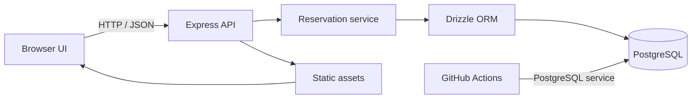
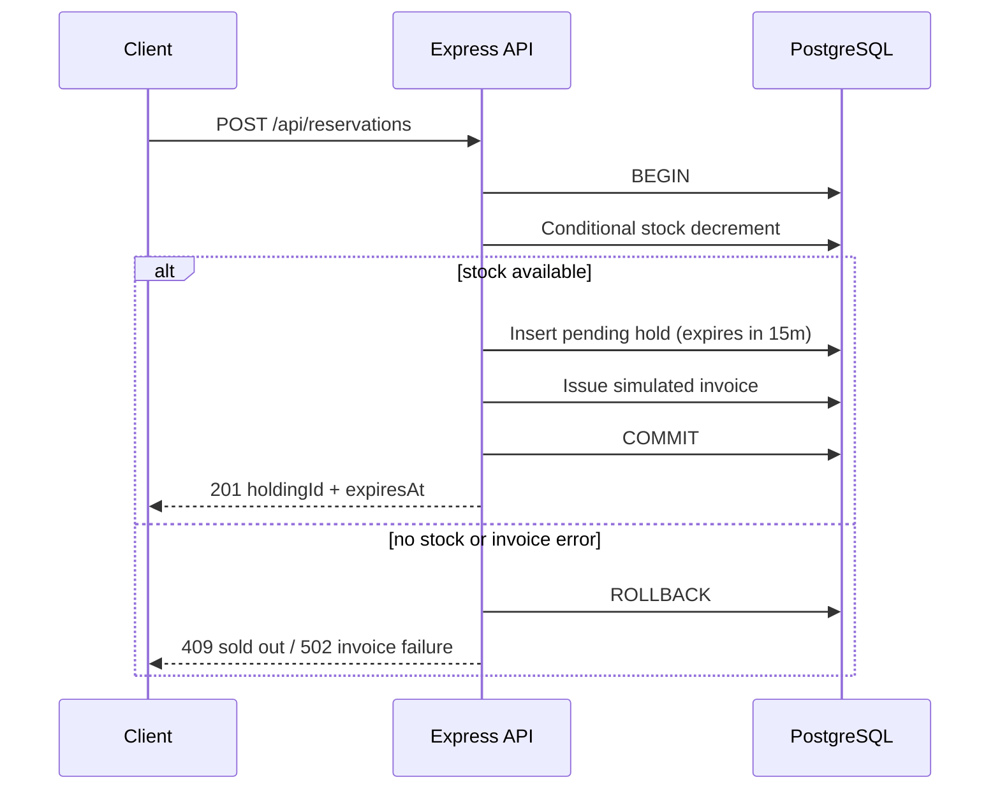

# FlashReserve

FlashReserve is a portfolio project for a high-concurrency flash-sale inventory reservation service. It demonstrates PostgreSQL-backed stock allocation, transactional reservation creation, expiry handling, and integration testing under concurrent requests.

The project includes a small browser UI for inspecting demo products and exercising reservation and checkout outcomes. Payment is simulated; no payment provider is contacted.

## Engineering goals

- Prevent inventory from becoming negative when requests compete for the final unit.
- Persist stock changes and reservation records atomically.
- Restore stock exactly once after a failed demo checkout or an expired hold.
- Exercise the critical transaction path against PostgreSQL, rather than mocking the database.
- Keep the database as the source of truth for inventory. Redis is not required for the correctness guarantees implemented here.

## Architecture



The browser UI is served by Express. The API uses Drizzle ORM with the PostgreSQL driver. Reservation state and inventory mutations are stored in PostgreSQL; the browser never updates stock directly.

## Reservation consistency model

The reservation service uses a conditional SQL update as its concurrency control point:

```sql
UPDATE products
SET stock = stock - $quantity
WHERE id = $product_id AND stock >= $quantity
RETURNING id;
```

PostgreSQL serializes conflicting updates to the same product row. A request that cannot decrement stock receives no returned row and is rejected as sold out. The decrement, reservation insert, and demo invoice issuance run in one Drizzle transaction. If invoice issuance throws, PostgreSQL rolls back both database writes.

Each successful hold is created with a 15-minute expiry. A background sweep runs at startup and every 15 seconds. It changes expired `pending` reservations to `expired` and restores their quantities in the same transaction. Demo checkout locks the reservation row with `SELECT ... FOR UPDATE` before changing its status. Failed checkout restores inventory in that transaction; repeated callbacks see a terminal status and do not restore stock a second time.



## API

All endpoints are served by the same Express process as the static UI.

| Method | Endpoint | Request | Result |
|---|---|---|---|
| `GET` | `/api/products` | None | Product ID, SKU, title, IDR price, and current stock. |
| `POST` | `/api/reservations` | `{ "productId": "<uuid>", "quantity": 1 }` | `201` with `holdingId`, `expiresAt`, and a simulated `invoiceId`; `409` when stock is insufficient. |
| `POST` | `/api/reservations/:holdingId/checkout` | `{ "outcome": "paid" }` or `{ "outcome": "failed" }` | Sets the demo reservation status. Failed checkout restores stock. |

Invalid reservation input returns `400`. An invoice adapter error returns `502` after the database transaction rolls back. Unknown holding IDs return `404`.

## Data model

| Table | Relevant columns | Purpose |
|---|---|---|
| `products` | `id`, `sku`, `title`, `price_idr`, `stock` | Product catalog and the authoritative inventory count. `stock` has a non-negative constraint. |
| `reservations` | `id`, `product_id`, `quantity`, `expires_at`, `invoice_id`, `status` | Hold records. Status values are `pending`, `paid`, `failed`, or `expired`. |
| `flashreserve_migrations` | `name`, `applied_at` | Applied SQL migration files. A PostgreSQL advisory transaction lock serializes migration runs. |

Schema definitions live in `src/db/schema.ts`; ordered SQL migrations live in `migrations/`.

## Tech stack

- TypeScript and Node.js 22
- Express 5
- PostgreSQL 16 and Drizzle ORM
- Vitest and Supertest
- ESLint and TypeScript compiler checks
- GitHub Actions with an ephemeral PostgreSQL service container

## Run locally

Prerequisites: Node.js 22, npm, and a reachable PostgreSQL database. The database itself must exist before migrations run.

1. Copy `.env.example` to `.env`.
2. Set either `DATABASE_URL`, or the `DB_CONNECTION`, `DB_HOST`, `DB_PORT`, `DB_DATABASE`, `DB_USERNAME`, and `DB_PASSWORD` values for your PostgreSQL server. For hosted databases, set `DB_SSLMODE` if your provider requires a specific mode. Keep `.env` private; it is git-ignored.
3. Install dependencies, migrate the database, add demo products, and start the app:

```sh
npm ci
npm run db:migrate
npm run db:seed
npm run dev
```

Open [http://localhost:3000](http://localhost:3000). The seed command inserts three demo products and updates their titles/prices on later runs while preserving existing stock values.

## Integration tests

Tests run against a real PostgreSQL database configured by `DATABASE_URL` or the `DB_*` variables in `.env`. Apply migrations before running them:

```sh
npm run db:migrate
npm test -- --run
```

The integration suite covers:

| Scenario | Assertion |
|---|---|
| Happy path | A hold ID is returned, stock is decremented, and expiry is approximately 15 minutes later. |
| Last-unit race | Ten simultaneous requests for one unit produce one `201`, nine `409` responses, and exactly one reservation. |
| Invoice issuance failure | The transaction leaves stock unchanged and creates no reservation. |
| Failed demo checkout | Stock is restored once, including when the callback is repeated. |
| Expiry sweep | Expired pending holds are marked and inventory is restored once. |

Fixtures use unique product SKUs and are deleted after the suite. The HTTP handler uses its own pooled database connections, so an outer test-owned transaction cannot contain its writes; cleanup is scoped to those fixture IDs. Each business operation itself uses a database transaction.

Run static checks with:

```sh
npm run lint
npm run typecheck
```

## Continuous integration

`.github/workflows/ci.yml` runs for pull requests targeting `main`. It uses `actions/setup-node` npm caching, starts PostgreSQL 16 as a runner service, runs ESLint and `tsc --noEmit`, applies migrations, then runs the automated test suite. CI dependency installation uses `npm ci` and the committed `package-lock.json` for reproducible installs.

## Screenshots and diagrams

The architecture and transaction sequence above are Mermaid diagrams rendered by GitHub. To attach browser screenshots, add image files under `docs/images/` and enable/adapt the Markdown examples below. Capture the storefront and a successful/failed demo checkout; avoid including database credentials or other secrets in screenshots.

<!--


-->

## Scope and limitations

- Payment and invoice issuance are simulated. The generated invoice ID is a local placeholder; no external payment gateway is contacted.
- The demo checkout endpoint is intentionally unauthenticated so reviewers can exercise both outcomes. Do not expose it as a production payment API.
- Invoice issuance runs inside the reservation transaction for this deterministic demo. A real remote gateway has external side effects and needs an idempotent outbox/saga or compensation design before production use.
- The expiry sweep runs in the application process. Its database state transition is safe to retry; production deployments with stronger scheduling/operational needs can move it to a dedicated worker.
- Redis is not used. PostgreSQL row updates provide the stock correctness boundary in this implementation.
