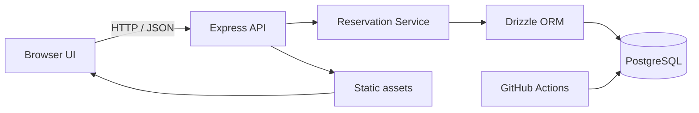

# FlashReserve

FlashReserve is a Node.js + TypeScript demo for handling flash-sale inventory reservations with strong consistency guarantees under concurrency.

It demonstrates how to reserve stock safely in PostgreSQL, prevent overselling during high contention, expire pending reservations, and restore inventory when payment or checkout fails.

## Why this project exists

This project is designed to model a real flash-sale flow without introducing mock-only logic. The main focus is on:

- preventing negative inventory under concurrent requests
- making reservation writes atomic with PostgreSQL transactions
- restoring stock when a reservation expires or checkout fails
- validating the critical path with integration tests against a real database

## Features

- Inventory reservation API with stock validation
- Conditional SQL update to prevent overselling
- 15-minute reservation expiry sweep
- Simulated invoice/payment flow for demo checkout outcomes
- Browser UI to try the flow without external payment providers
- PostgreSQL-backed persistence with Drizzle ORM
- Vitest integration tests for race conditions and rollback scenarios

## Tech stack

- Node.js 22
- TypeScript
- Express
- PostgreSQL
- Drizzle ORM
- Vitest
- ESLint
- GitHub Actions

## Architecture



The browser UI is served by the same Express app that exposes the API. Product and reservation state live in PostgreSQL, while the app logic is implemented in TypeScript.

## Core consistency model

The core inventory protection is a conditional update:

```sql
UPDATE products
SET stock = stock - $quantity
WHERE id = $product_id AND stock >= $quantity
RETURNING id;
```

This is the critical concurrency control point. If two requests compete for the last item, only one update succeeds. The losing request is rejected as sold out. The inventory decrement, reservation insert, and invoice simulation happen in one database transaction, so failed invoice processing rolls back the entire operation.

Expired reservations are automatically released by a background sweep and their stock is restored in the same transaction. Failed checkout also restores inventory exactly once.

## API

### Get products

```http
GET /api/products
```

Returns catalog data including product ID, SKU, title, price in IDR, and stock.

### Create reservation

```http
POST /api/reservations
Content-Type: application/json

{
  "productId": "<uuid>",
  "quantity": 1
}
```

Response:

- `201 Created` when stock is available
- `409 Conflict` when stock is insufficient
- `400 Bad Request` for invalid input

Returns a reservation ID and expiry timestamp.

### Checkout reservation

```http
POST /api/reservations/:holdingId/checkout
Content-Type: application/json

{
  "outcome": "paid"
}
```

Supported outcomes:

- `paid`
- `failed`

If the outcome is `failed`, the reserved stock is restored. Repeated checkout attempts for terminal states do not double-restore inventory.

## Local development

### Prerequisites

- Node.js 22+
- npm
- PostgreSQL database available locally or remotely

### 1. Install dependencies

```bash
npm ci
```

### 2. Configure environment

Copy the example environment file and update it with your PostgreSQL settings:

```bash
cp .env.example .env
```

Then adjust values such as:

```env
DB_CONNECTION=pgsql
DB_HOST=localhost
DB_PORT=5432
DB_DATABASE=flashreserve
DB_USERNAME=postgres
DB_PASSWORD=postgres
PORT=3000
```

### 3. Run database migrations and seed

```bash
npm run db:migrate
npm run db:seed
```

### 4. Start the app

```bash
npm run dev
```

Open `http://localhost:3000` in the browser.

## Scripts

```bash
npm run dev         # start the app in watch mode
npm run start       # start the app normally
npm run lint        # run ESLint
npm run typecheck   # run TypeScript checks
npm run db:migrate  # apply migrations
npm run db:seed     # add demo products
npm test            # run tests
```

## Testing

The project uses real PostgreSQL-backed integration tests, not mocked database calls.

```bash
npm run db:migrate
npm test -- --run
```

The test suite covers:

- happy-path reservation flow
- last-unit race condition handling
- invoice failure rollback
- failed checkout restoration
- expiry sweep logic

## Project structure

```text
.
├── src/
│   ├── app.ts
│   ├── server.ts
│   ├── db/
│   └── reservations/
├── migrations/
├── scripts/
├── public/
├── tests/
├── .env.example
├── package.json
├── tsconfig.json
├── vitest.config.ts
├── eslint.config.js
├── README.md
└── .gitignore
```

## CI

The repository includes a GitHub Actions workflow that runs linting, TypeScript checks, migrations, and tests with PostgreSQL in CI.

## Notes and limitations

- Payment handling is simulated for the demo; no real payment gateway is contacted.
- The checkout endpoint is intentionally unauthenticated because this is a portfolio/demo project.
- The expiry sweep runs in the application process and is safe to retry.
- This implementation intentionally uses PostgreSQL as the source of truth for inventory, without Redis.

## License

This project is intended for learning, demo, and portfolio use.
